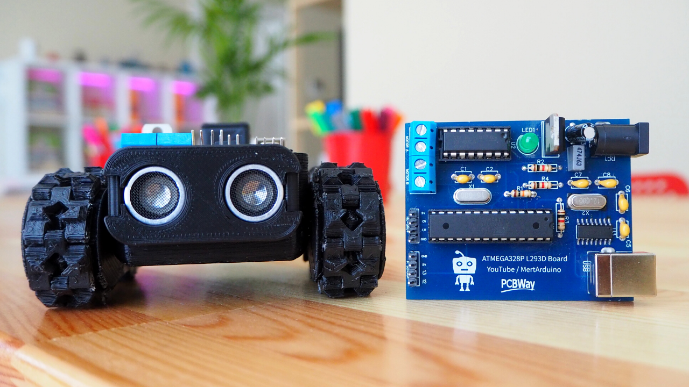
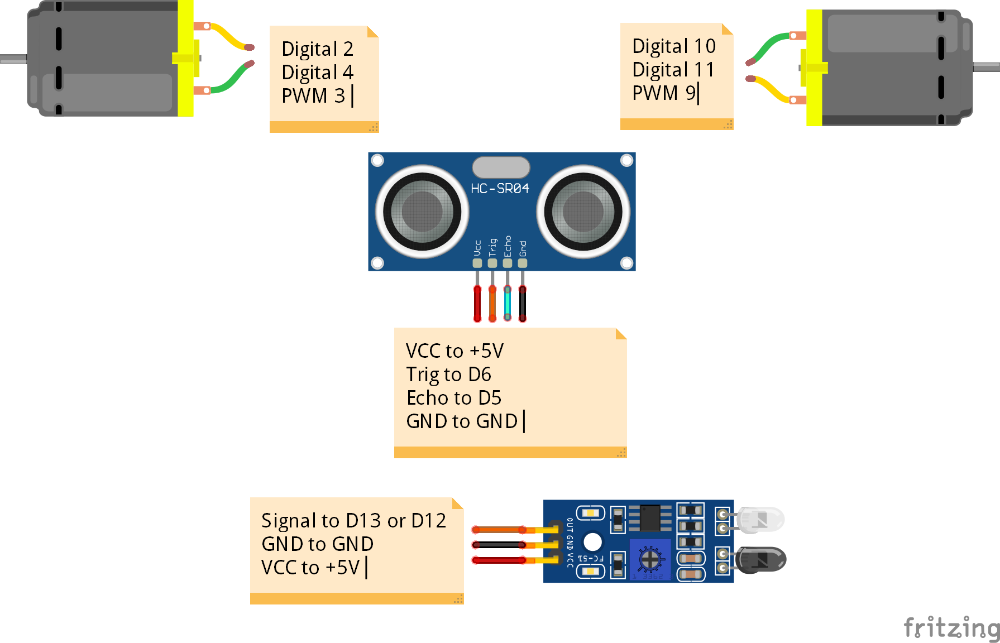

# Make at least 5 Robot Projects with one Board!
This robot control board contains an ATmega328P microcontroller and an L293D motor driver. Of course, it is no different from an Arduino Uno board but it is more useful because it does not need another shield to drive the motor! It is free from jumper clutter and can be easily programmed with the CH340G. While driving two DC motors, you can also control different sensors by using I / O pins with this card. In this project, we used an HC-SR04 ultrasonic distance sensor and an IR infrared sensor. In addition, one servo motor was used.  
**Full tutorial:** http://bit.ly/MertArduino   
   
**You can program a robot with 5 different scenarios with this control card. The following scenarios are included in this project:**   
- **SUMO mode:** It is a sport in which two robots attempt to push each other out of a circle (in a similar fashion to the sport of sumo). 
- **Follow Me Mode:** It can sense the presence of object to be followed using HC-SR04 sensor.  
- **Tracking Mode:** Line follower Robot is a vehicle which follows a line, either a black line or white line.  
- **Avoiding Mode:** Obstacle Avoiding Robot is an intelligent device which can automatically sense the obstacle in front of it and avoid them by turning itself in another direction.  
- **Drawing Mode:** It contains servo motor and a pen. It can draw its own movement tracks on the surface.   
In this project, DIP type components were used for easy soldering.   
**Get the PCB & 3D Files:** https://bit.ly/2WycZxT   
# Required Hardwares:  
- **ATmega328P-PU with Bootloader:** https://bit.ly/2U9iwJw  
- **L293D Motor Driver IC:** https://bit.ly/33BV2ju  
- **Type B USB Socket:** https://bit.ly/2WBSQqw  
- **DIP Socket 28/16 Pins:** https://bit.ly/2UahQDK  
- **12/16 MHz Crystal:** https://bit.ly/33FNTyL  
- **L7805 TO-220:** http://bit.ly/2N5WnYG  
- **100uF Capacitor:** https://bit.ly/2U98JTU  
- **LED:** http://bit.ly/37OajhS  
- **Resistor 10K/ 1K:** https://bit.ly/2WFsNPl  
- **470nF Capacitor:** https://bit.ly/2UwQ2bw  
- **Power Jack Socket:** http://bit.ly/2QAzFdp  
- **2 Pin Terminal Block:** http://bit.ly/2lEgy58  
- **Male Pin Header:** https://bit.ly/3ab5h0w  
- **10nF / 22pF Ceramic:** https://bit.ly/2WCuQ6Y  
- **6V 200RPM Mini Metal Gear Motor:** https://bit.ly/2Qyt0QD  
- **7.4V 1000mAh 2S Lipo Battery (Optional):** https://bit.ly/2xdLUp3  
- **9V 800mAh Battery (Optional):** http://bit.ly/32oPu9X  
- **9V Battery Connector:** https://bit.ly/2Ua9b4k  
- **Ultrasonic Module HC-SR04:** https://bit.ly/2y2apWJ  
- **IR Infrared Sensor:** https://bit.ly/2WCQgAS   
# Connections
   
